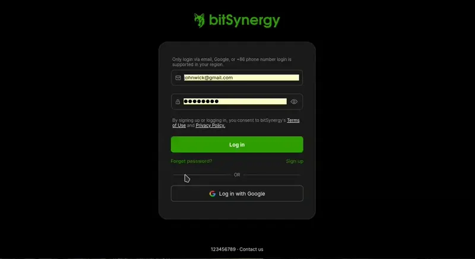

# bitSynergy
AI client to interact with LLMs using Ollama API.



## ✨ Features
- JWT Authentication
- Support for multimodal LLMs
- Mobile view
- Abstracted ollama API from client using proxy
- Scalable due to decoupling which makes it easier to add load balancing and rate limiting
- Choose from installed models to interact with
- Protected routes
- AI interactions are saved using mongoDB under your account
- Modular and scalable codebase
- GUI heavily inspired by https://chat.deepseek.com/
- Logging

## 🛠️ Tech Stack
### Frontend (Client)
- React 19 + Vite
- typescript
- Axios (for API calls)
### Backend (Server)
- Node.js
- Express.js
- MongoDB / Mongoose

## 📁 Project Structure
```
bitSynergy/
├── client/
│	├── public/
│	└── src/
│		├── assets/
│		├── authentication/
│		├── components/
│		├── context/
│		├── layout/
│		├── pages/
│		├── request/
│		└── utils/
│
├── server/
│	├── config/
│	├── controllers/
│	├── logs/
│	├── middleware/
│	├── model/
│	└── routes/
│
├── runProject.sh
├── .gitignore
└── README.md
```

## ⚙️ Getting Started

### 1. Clone the Repo
```bash
git clone https://github.com/setAutomata/bitsynergy.git
cd bitsynergy
```

### 2. Install Dependencies
```bash
npm install
cd server && npm install
cd client && npm install
```

### 3. Setup Environment Variables
Create `.env` files in both `client/` and `server/` directories:
- On *server/***.env**
```
PORT=5000
MONGO_URI=your_mongodb_uri
JWT_SECRET=your_secret_key
```
you can generate *secret key* using Node.Js:
```bash
node
require('crypto').randomBytes(64).toString('hex')
```
- On *client/***.env**
```
VITE_API_BASE_URL=http://localhost:5000/api
```

### 4. Run the App
```bash
cd server/ && npm run dev
cd client/ && npm run dev
```
- (optional) For Linux users on gnome desktop environment, you can run the *runProject.sh* shell script:
```bash
sudo chmod +x runProject.sh
./runProject.sh
```

### Ollama setup for mobile phone
- On Linux
```bash
sudo systemctl edit ollama.service

```
add the line:
```
[Service]
Environment="OLLAMA_HOST=0.0.0.0"
Environment="OLLAMA_ORIGINS=http://<your local ip>:*"
```
- On Mac
```
launchctl setenv OLLAMA_HOST "0.0.0.0"
launchctl setenv OLLAMA_ORIGINS "http://<your local ip>:*"
```

## 🤝 Contributing
This project is part of my portfolio. Feel free to provide suggestions and improvements.
